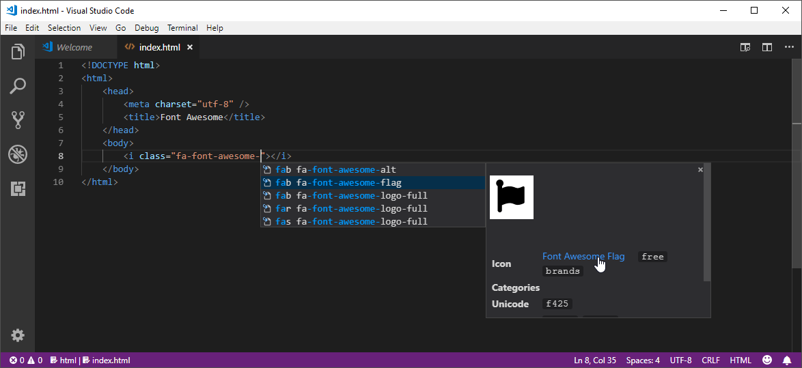

# Font Awesome Auto-complete & Preview


[](https://marketplace.visualstudio.com/items?itemName=Janne252.fontawesome-autocomplete)

Auto-complete & preview Font Awesome `5.13.0` or `4.7.0` icons in any language (see [configuration](#configuration)).

## Default usage
Type "`fa-`" (without quotes) to start auto-completing icons. If the icon preview is not showing up (as shown in the GIFs below), press `Ctrl+Space` (default hotkey) or press the  "Read More..." button to expand the details view.

### Example


## Additional features

### Mouse-over documentation


## Configuration
The following options can be set in the settings to configure the behavior of the extension:
```javascript
{
    // Font Awesome version to use.
    "fontAwesomeAutocomplete.version": "5",
    // List of glob patterns that determine where Font Awesome 5 Autocomplete will provide suggestions.
    "fontAwesomeAutocomplete.patterns": [
        "**/*.html"
    ],
    // A word that triggers the auto completion of Font Awesome icons. Last character of the trigger word is also the trigger character for auto completion menu.
    "fontAwesomeAutocomplete.triggerWord": "fa-",
    // A list of glob patterns for which the extension should NOT auto-remove the trigger word when a font class name is inserted from the auto completion list.
    "fontAwesomeAutocomplete.disableTriggerWordAutoClearPatterns": ["**/*.html"],
    // Background color of a Font Awesome icon preview. Supports any valid CSS color.
    "fontAwesomeAutocomplete.preview.backgroundColor": "#ffffff",
    // Foreground color of a Font Awesome icon preview. Supports any valid CSS color.
    "fontAwesomeAutocomplete.preview.foregroundColor": "#000000",
    // Allows overriding the inserted text per file type when an autocompletion item is selected. Available template placeholders are {style}, {name}, and {prefix}.
    "fontAwesomeAutocomplete.insertionTemplate": {
        "**.html": "{style} {prefix}{name}",
        "**/*.vue": "<font-awesome-icon :icon=\"['{style}', '{name}']\" />"
    }
}
```
The extension listens for changes in the settings and auto-reloads itself when necessary. 

## Troubleshooting tips
- Font Awesome icons only appear in the auto completion item list if the current word starts with the value of **`fontAwesomeAutocomplete`.`triggerWord`**, e.g. "`fa-`".
   - The last character of the trigger word (e.g. `-`) also works as the trigger character for the auto completion menu.
- If a selected icon class name is malformed (parts of it missing) or parts of the document got removed, try adding the current file extension as a glob pattern (e.g. `"**/*.html"`) to the `disableTriggerWordAutoClearPatterns` setting. If that doesn't help, please open an issue!
- If a custom insertion template is configured and the mouse-over documentation does not work, please open an issue. Make sure to provide the custom insertion template for reference and issue reproduction.

## Installation
 - [Font Awesome Autocomplete on Visual Studio Marketplace](https://marketplace.visualstudio.com/items?itemName=Janne252.fontawesome-autocomplete)

## Change Log
 - See [CHANGELOG.md](CHANGELOG.md)

## License
 - See [LICENCE.md](LICENCE.md)
 