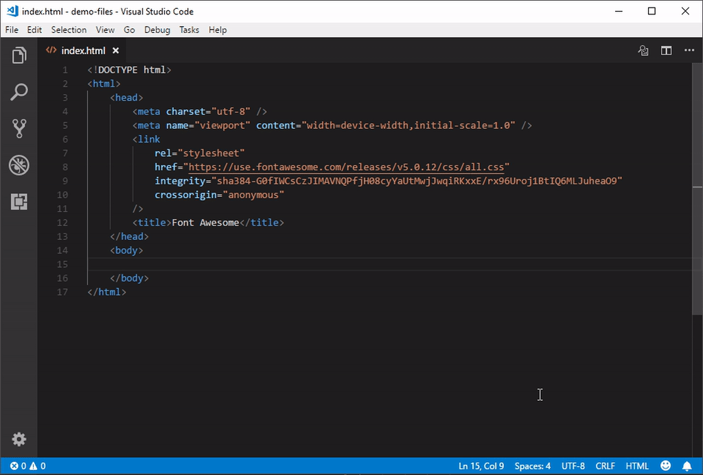
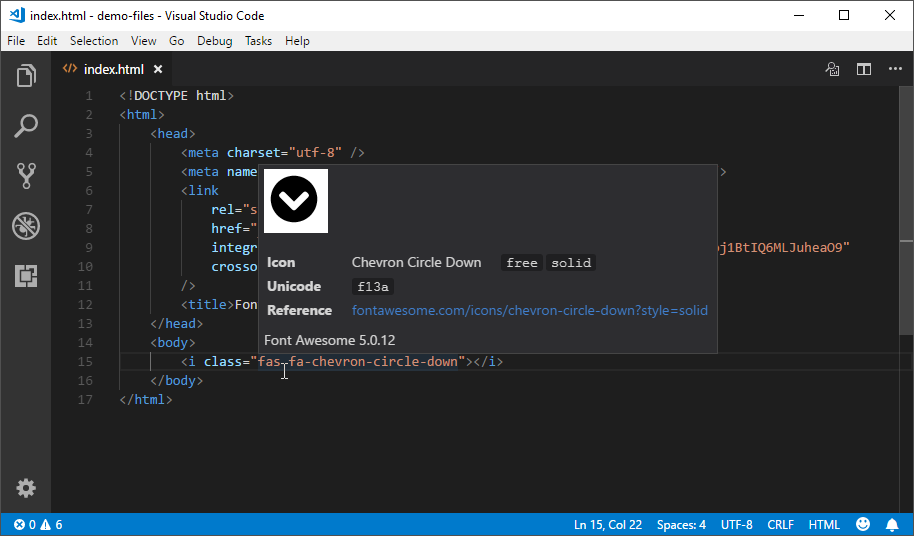

# Font Awesome 5 auto-complete

## Features
Provides Font Awesome 5.0.13/4.7.0 CSS class names as autocompletion items for any language (see [configuration](#configuration))

## Example usage


## Additional features

#### Mouse-over documentation


## Configuration
The following options can be set in the settings to configure the behavior of the extension:
```javascript
{
    // Font Awesome version to use.
    "fontAwesomeAutocomplete.version": "5",
    // List of glob patterns that determine where Font Awesome 5 Autocomplete will provide suggestions.
    "fontAwesomeAutocomplete.patterns": [
        "**/*.html"
    ],
    // List of characters that trigger Font Awesome 5 Autocomplete.
    "fontAwesome5Autocomplete.triggerCharacters": [
        "f"
    ],
    // Background color of a Font Awesome icon preview. Supports any valid CSS color.
    "fontAwesomeAutocomplete.preview.backgroundColor": "#ffffff",
    // Foreground color of a Font Awesome icon preview. Supports any valid CSS color.
    "fontAwesomeAutocomplete.preview.foregroundColor": "#000000"
}
```
The extension listens for changes in the settings and auto-reloads itself when necessary. 