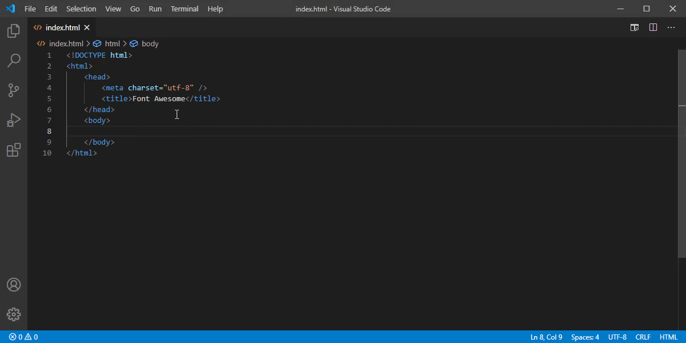

# Font Awesome Auto-complete & Preview

[](https://fontawesome.com) [](https://fontawesome.com/v4.7.0/)


Auto-complete & preview Font Awesome `5` or `4` icons in any language (see [configuration](#configuration)).

## Installation
| Product / installation type | Platform |
|-----------------------|----------------------|
|[**VS Code**](https://code.visualstudio.com/)|[](https://marketplace.visualstudio.com/items?itemName=Janne252.fontawesome-autocomplete)|
|[**VSCodium**](https://vscodium.com/)|[](https://open-vsx.org/extension/Janne252/fontawesome-autocomplete)|
|Manual `.vsix` file|[](https://github.com/Janne252/vscode-fontawesome-auto-complete/releases)|


## Default usage
Type "`fa-`" (without quotes) to start auto-completing icons. If the icon preview is not showing up (as shown in the GIFs below), press `Ctrl+Space` (default hotkey) or press the  "Read More..." button to expand the details view.

## Additional features

### Mouse-over documentation


## Configuration
The following options can be set in the settings to configure the behavior of the extension:
```javascript
{
    // Font Awesome version to use.
    "fontAwesomeAutocomplete.version": "5",
    // List of glob patterns that determine where Font Awesome 5 Autocomplete will provide suggestions.
    "fontAwesomeAutocomplete.patterns": [
        "**/*.html"
    ],
    // A word that triggers the autocompletion of Font Awesome icons. Last character of the trigger word is also the trigger character for autocompletion menu.
    "fontAwesomeAutocomplete.triggerWord": "fa-",
    // A list of glob patterns for which the extension should NOT auto-remove the trigger word when a font class name is inserted from the autocompletion list.
    "fontAwesomeAutocomplete.disableTriggerWordAutoClearPatterns": ["**/*.html"],
    // Background color of a Font Awesome icon preview. Supports any valid CSS color.
    "fontAwesomeAutocomplete.preview.backgroundColor": "#ffffff",
    // Foreground color of a Font Awesome icon preview. Supports any valid CSS color.
    "fontAwesomeAutocomplete.preview.foregroundColor": "#000000",
    // Allows overriding the inserted text per file type when an autocompletion item is selected. 
    // Available template placeholders are {style}, {styleName}, {name}, and {prefix}. 
    // {name} supports the following formatters: camelCase, kebabCase, pascalCase, and snakeCase. Usage: {name:formatter}, e.g. {name:camelCase}
    "fontAwesomeAutocomplete.insertionTemplate": {
        "**/*.html": "{style} {prefix}{name}"
    }
    // Artificially increases the importance of completion items. Enabled by default as FontAwesome Autocomplete extension only provides suggestions based on the triggerWord setting.
    "fontAwesomeAutocomplete.enableElevatedSortPriority": true
}
```
The extension listens for changes in the settings and auto-reloads itself when necessary. 

# Troubleshooting / FAQ
## I'm not using standard CSS class name icon references
See [Insertion templates for 3rd party libraries](#insertion-templates-for-3rd-party-libraries).

## Autocompletion suggestions are not appearing
See the [configuration reference](#configuration).
Font Awesome icons only appear in the autocompletion item list if the current word starts with the value of the setting **`fontAwesomeAutocomplete`.`triggerWord`**, e.g. "`fa-`" (default).
   - The last character of the trigger word (e.g. `-`, which is the default) also works as the trigger character for the autocompletion menu.

## Malformed / incomplete / weird output after choosing an autocompletion item
Try adding the current file extension as a glob pattern (e.g. `"**/*.html"`) to the **`fontAwesomeAutocomplete.disableTriggerWordAutoClearPatterns`** setting. If that doesn't help, please open an issue!

## Mouse-over documentation does not work with a custom insertion template
If a custom insertion template is configured and the mouse-over documentation does not work, please open an issue. Make sure to provide the custom insertion template for reference and issue reproduction.

## Autocompletion suggestions of this extension appear at the end of the list
This is usually caused by another extension having higher priority, especially if the other extension provides snippets.
- Make sure the setting **`fontAwesomeAutocomplete.enableElevatedSortPriority`** is set to `true` (default)
- Set the setting **`editor.snippetSuggestions`** to `"bottom"`
If you're still having trouble with the sort order of the autocompletion items, please open issue. 

# Insertion templates for 3rd party libraries
-  [@fortawesome/vue-fontawesome](https://github.com/FortAwesome/vue-fontawesome)
    ```json
    {
        "**/*.vue": "<font-awesome-icon :icon=\"['{style}', '{name}']\" />"
    }
    ```
-  [@fortawesome/free-**`brands|regular|solid`**-svg-icons](https://github.com/FortAwesome/Font-Awesome)
    ```json
   {
       "**/*.vue": "import {fa{name:pascalCase}} from '@fortawesome/free-{styleName}-svg-icons';"
   }
    ```

# Changelog
See [CHANGELOG.md](CHANGELOG.md)

# License
See [LICENCE.md](LICENCE.md)
 